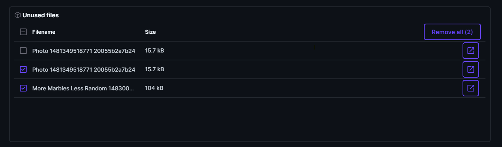
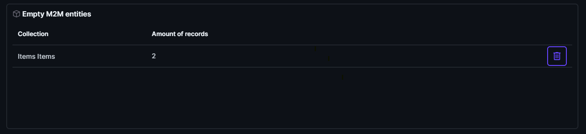

# Directus admin panels

Adds panels to Directus to manage Directus more efficient.

## Details

Directus lacks native functionalities for identifying or removing unused files and empty M2M (Many-to-Many) records. This extension aims to address this limitation. It comprises two panels: one facilitates the viewing and deletion of unused files, while the other detects and deletes empty or invalid M2M records within the junction table.

### Todo list

- Support for easily detecting Activities and Revisions, including the option to clean them up.
- Table count, show an overview of all tables that are indexed inside of Directus, including the name, amount of records, diskspace used.

## Set Up Instructions

To install this extension you only need to use:

```sh
npm i directus-extension-admin-panels
```

or

```sh
yarn add directus-extension-admin-panels
```

## Screenshots




## Collaborators

- Attacler
