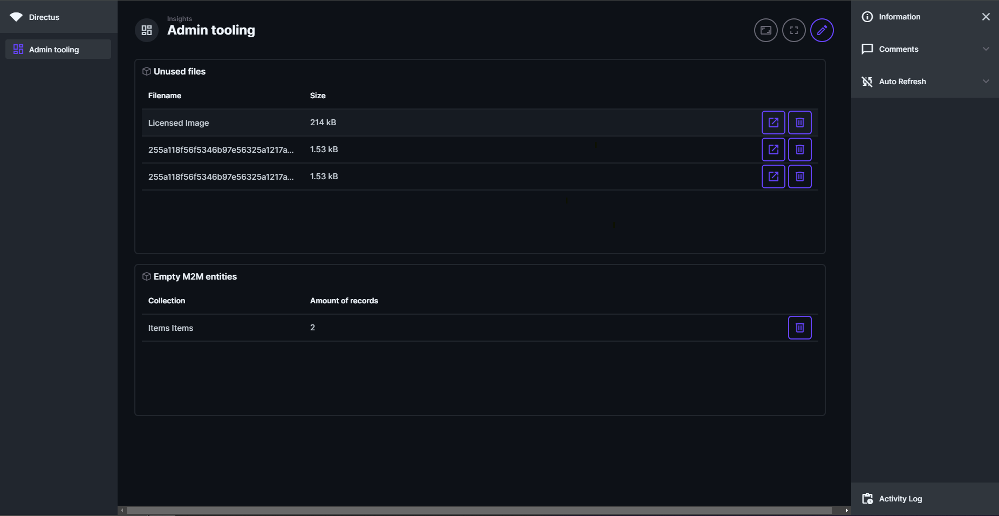

# Directus admin panels

Adds panels to Directus to manage Directus more efficient.

## Details

Directus does not have built in methods to see what files are unused or M2M records are empty, this bundle tries to solve that.
The bundle includes 2 panels, one for viewing unused files, the other one is for detecting empty/invalid M2M records inside of the junction table.

### Todo list

- Support for easily detecting Activities and Revisions, including the option to clean them up.
- Table count, show an overview of all tables that are indexed inside of Directus, including the name, amount of records, diskspace used.

## Set Up Instructions

To install this extension you only need to use:

```sh
npm i directus-extension-admin-panels
```

or

```sh
yarn add directus-extension-admin-panels
```

## Screenshots



## Collaborators

- Attacler
